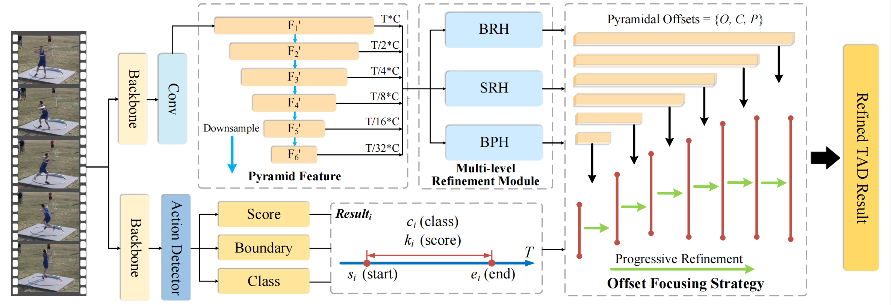

# [ACM MM 2023] RefineTAD: Learning Proposal-free Refinement for Temporal Action Detection



## Overview

This repository contains the code for _RefineTAD: Learning Proposal-free Refinement for Temporal Action Detection_ [paper](https://dl.acm.org/doi/abs/10.1145/3581783.3611872), which has been accepted for ACM MM 2023. Our code is built upon the
codebase from [ActionFormer](https://github.com/happyharrycn/actionformer_release)
and [TriDet](https://github.com/dingfengshi/TriDet), and we would like to express our
gratitude for their outstanding work.

## Update Log
- **2023.11.1 Our RefineTAD receives the [Best Paper Honorable Mention Award](https://www.acmmm2023.org/) of ACM MM 2023.**
- 2023.10.21 We release the source code.
- 2023.7.26 Our paper has been accepted for ACM MM 2023.

## Installation

1. Please ensure that you have installed PyTorch and CUDA. **(This code requires PyTorch version >= 1.11. We use
   version=1.11.0 in our experiments)**

2. Install the required packages by running the following command:

```shell
pip install -r requirements.txt
```

3. Done! We are ready to get start!

## Data Preparation

- We adpot the feature for **THUMOS14**, **ActivityNet-1.3** and **EPIC KITCHEN 100** datasets
  from ActionFormer repository ([see here](https://github.com/happyharrycn/actionformer_release)).
  To use these features, please download them from their link and unpack them into the `./data` folder.

## Quick Start
**TODO**
We provide a list of scripts that allow you to reproduce our results with just one click. These scripts are located in
the `./tools` folder and include:

- thumos_i3d_script.sh
- epic_noun_slowfast_script.sh
- epic_verb_slowfast_script.sh
- ant_tsp_script.sh

To easily reproduce our results, simply run the following command:

```shell
bash SCRIPT_PATH GPU_NUM
```

For example, if you want to train and eval our model on THUMOS14 dataset using the first GPU on you machine, you can
run:

```shell
bash tools/thumos_i3d_script.sh 0
```

The mean average precision (mAP) results for each dataset are:

**TODO**

*There has been a slight improvement in the results of some datasets compared to those reported in the paper.
*Note: We conduct all our experiments on a single A5000 GPU and the training results may vary depending on the type of GPU used.

## Test

The command for test is

```shell
python eval.py ./configs/CONFIG_FILE PATH_TO_CHECKPOINT
```

## Contact

If you have any questions about the code, feel free to contact fengyue5717 at nuaa dot edu dot cn.

## References

If you find this work helpful, please consider citing our paper

```
@inproceedings{feng2023refinetad,
  title={RefineTAD: Learning Proposal-free Refinement for Temporal Action Detection},
  author={Feng, Yue and Zhang, Zhengye and Quan, Rong and Wang, Limin and Qin, Jie},
  booktitle={Proceedings of the 31st ACM International Conference on Multimedia},
  pages={135--143},
  year={2023}
}
```
 
